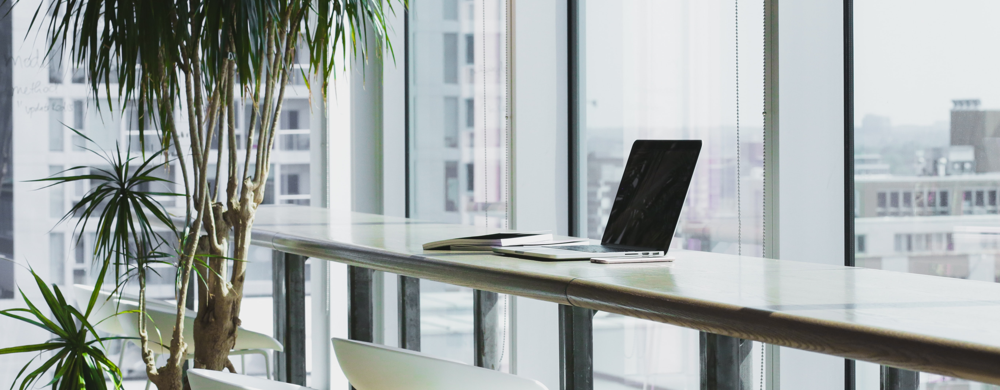
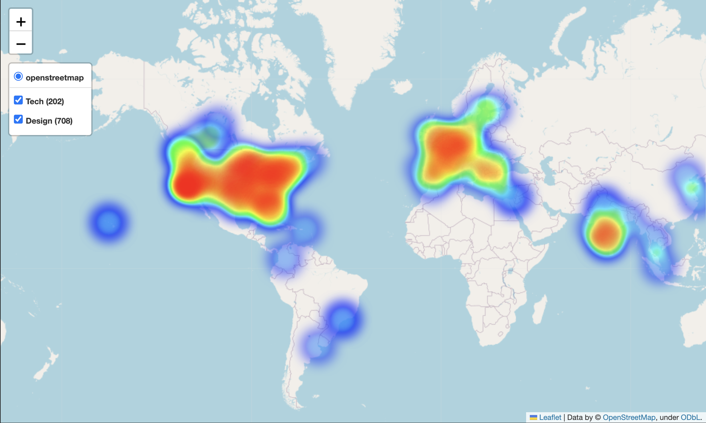
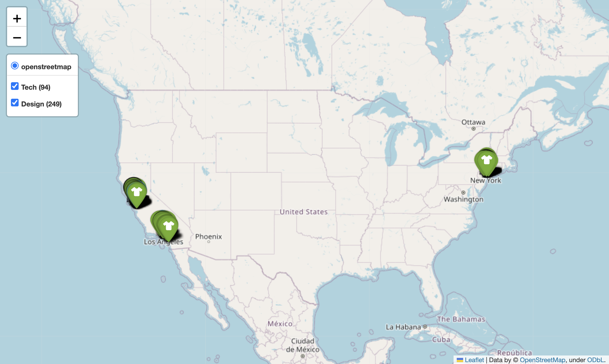
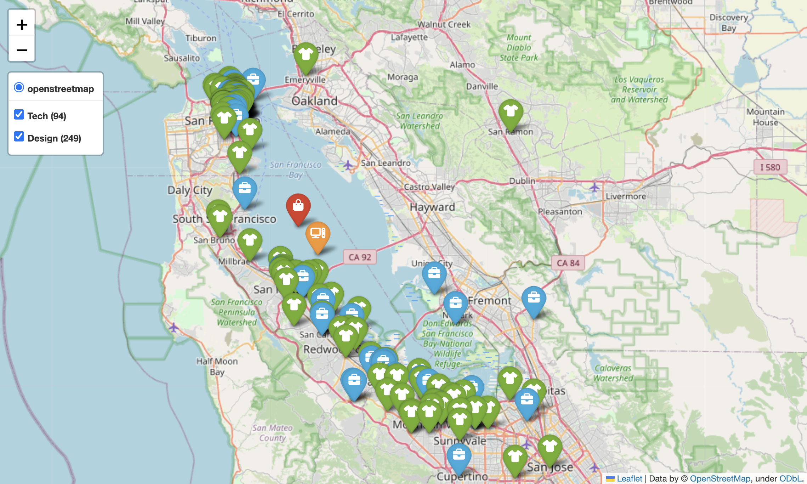
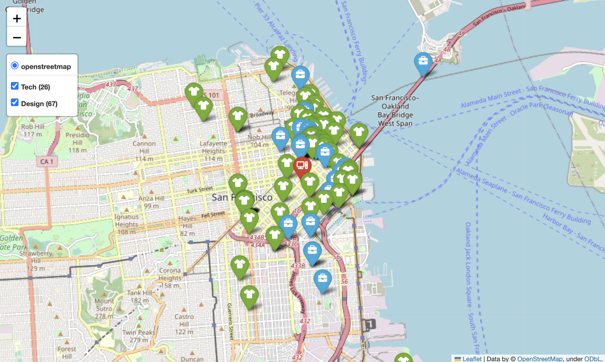

# Project-III-geospatial-data
### Andrés Castro | Project III Geospatial Data

## Context
This project analyzed the best location for a new company office taking into account the following criteria considered to satisfy the needs of the team:

1. Proximity to other tech startups that had raised more than 1 MM USD and design companies
2. Proximity to airports
3. Proximity to schools
4. Proximity to Starbucks
5. Proximity to restaurants with vegan options
6. Proximity to a basketball court
7. Proximity to pet grooming services

## Data Collection
To gather the relevant data, the following data sources were used:

- List of tech and design companies from the Crunchbase Mongo DB.
- GeoJson data of major city boundaries (rough circle encompassing the cities) built using www.geojson.io
- Foursquare API to get information on nearby venues (airports, schools, Starbucks, restaurants with vegan options, basketball courts, pet grooming services)

## Methodology
Tech startups and design companies were queried from the crunchbase Mongo DB.
A heatmap of all these companies was created and it was determined that the cities with more companies of these sectors were Los Angeles, San Francisco, New York, Miami, Paris and Manchester.

The top 3 (by ammount of companies) were considered for further analysis: San Francisco, Los Angeles and New York but it was decided to focus only on San Francisco for the rest of the analysis.

The GeoJson data of San Francisco was used to divide the city into two areas: San Francisco city center and nearby southern cities.
    This was done because the mean point of the location of all companies in this area fell in the middle of the San Francisco Bay.

The mean coordinates of tech and design companies in both areas were calculated to find the center of each sector and each area.
The mean coordinates of the centers of both sectors were calculated to find the ideal location for the new office and it was decided that the city center had a higher ammount of nearby companies and that they were closer together.

Then, the Foursquare API was used to find nearby venues that satisfy all the specified requirements.
The final map was created with the new office location, nearby companies, and nearby venues.

## Results
The optimal location for the new office was found to be at coordinates [37.7824, -122.4039] in the San Francisco city center. The final map shows that this location satisfies all specified requirements, with nearby airports, schools, Starbucks, restaurants with vegan options, a basketball court, and pet grooming services.

## Conclusion
This project analyzed the best location for a new company office in San Francisco, taking into consideration proximity to other tech and design companies and various other required amenities. The results show that the optimal location is in the San Francisco city center and satisfies all specified requirements.